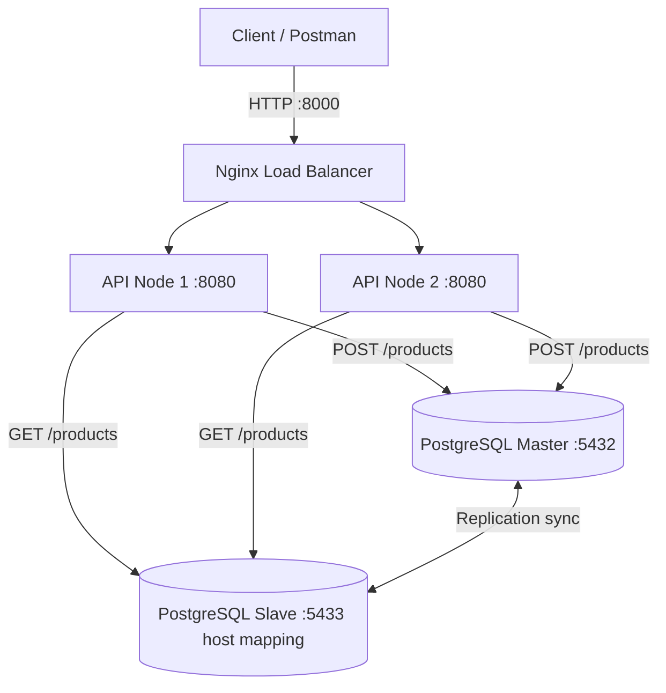

# Scalable System Technical Documentation

This project demonstrates a simple scalable web stack built with Docker Compose, Nginx, ASP.NET Core, and PostgreSQL replication.

## System Architecture



Request flow:

1. The client sends requests to Nginx on port `8000`.
2. Nginx forwards traffic to one of the API containers using round-robin upstream balancing.
3. `POST /products` writes to the PostgreSQL master.
4. `GET /products` reads from the PostgreSQL slave.
5. The slave stays synchronized from the master through PostgreSQL replication.

## Configuration Snippets

### Nginx

File: `config/nginx/nginx.conf`

```nginx
events { worker_connections 1024; }

http {
    upstream api_backend {
        server api_node_1:8080;
        server api_node_2:8080;
    }

    server {
        listen 80;

        location / {
            proxy_pass http://api_backend;
            proxy_set_header Host $host;
            proxy_set_header X-Real-IP $remote_addr;
        }
    }
}
```

Key settings:

- `upstream api_backend` balances requests across both API containers.
- `proxy_pass` sends all traffic to the upstream group.
- `proxy_set_header` preserves client request metadata.

### Database

File: `docker-compose.yml`

```yaml
pg-master:
  image: bitnami/postgresql:latest
  environment:
    - POSTGRESQL_REPLICATION_MODE=master
    - POSTGRESQL_REPLICATION_USER=repl_user
    - POSTGRESQL_REPLICATION_PASSWORD=repl_password
    - POSTGRESQL_USERNAME=myuser
    - POSTGRESQL_PASSWORD=mypassword
    - POSTGRESQL_DATABASE=mydb
  ports:
    - "5432:5432"

pg-slave:
  image: bitnami/postgresql:latest
  depends_on:
    - pg-master
  environment:
    - POSTGRESQL_REPLICATION_MODE=slave
    - POSTGRESQL_REPLICATION_USER=repl_user
    - POSTGRESQL_REPLICATION_PASSWORD=repl_password
    - POSTGRESQL_MASTER_HOST=pg-master
    - POSTGRESQL_MASTER_PORT_NUMBER=5432
    - POSTGRESQL_USERNAME=myuser
    - POSTGRESQL_PASSWORD=mypassword
  ports:
    - "5433:5432"
```

Key settings:

- The master database listens on host port `5432`.
- The slave database is mapped to host port `5433`.
- The slave connects back to the master using the Docker service name `pg-master`.

### API Database Connection Logic

File: `api/Program.cs`

```csharp
var masterConnStr = builder.Configuration["ConnectionStrings:MasterDb"];
var slaveConnStr = builder.Configuration["ConnectionStrings:SlaveDb"];

app.MapPost("/products", async (ProductDto product) =>
{
    using var conn = new NpgsqlConnection(masterConnStr);
    await conn.OpenAsync();

    using var cmd = new NpgsqlCommand("INSERT INTO products (name, price) VALUES (@n, @p) RETURNING id", conn);
    cmd.Parameters.AddWithValue("n", product.Name);
    cmd.Parameters.AddWithValue("p", product.Price);

    var insertedId = await cmd.ExecuteScalarAsync();

    return Results.Ok(new { Message = "Created successfully", Id = insertedId, product.Name, product.Price });
});

app.MapGet("/products", async () =>
{
    using var conn = new NpgsqlConnection(slaveConnStr);
    await conn.OpenAsync();

    using var cmd = new NpgsqlCommand("SELECT id, name, price FROM products", conn);
    using var reader = await cmd.ExecuteReaderAsync();
    ...
});
```

Key settings:

- `ConnectionStrings:MasterDb` targets `pg-master:5432` for writes.
- `ConnectionStrings:SlaveDb` targets `pg-slave:5432` for reads.
- The `products` table is created automatically against the master connection on startup.

## Setup Guide

### Prerequisites

- Docker Desktop or Docker Engine with Compose support
- A terminal in the repository root
- Optional: Postman or `curl` for testing the endpoints

### Run the stack

1. Open the repository root: `Assignment-2_Scalable-System`.
2. Start all services:

```bash
docker compose up --build
```

3. Wait until these containers are running:

- `pg-master`
- `pg-slave`
- `api_node_1`
- `api_node_2`
- `nginx_lb`

4. Access the API through Nginx at:

```text
http://localhost:8000
```

### Verify the API

Create a product:

```bash
curl -X POST http://localhost:8000/products \
  -H "Content-Type: application/json" \
  -d "{\"name\":\"Keyboard\",\"price\":1200}"
```

Read products:

```bash
curl http://localhost:8000/products
```

The GET response includes a `processed_by` field so you can see which API container handled the request.

### Stop the stack

```bash
docker compose down
```

## Notes

- The API listens on port `8080` inside each container.
- Nginx listens on host port `8000`.
- Host port `5432` maps to the PostgreSQL master and host port `5433` maps to the slave.
